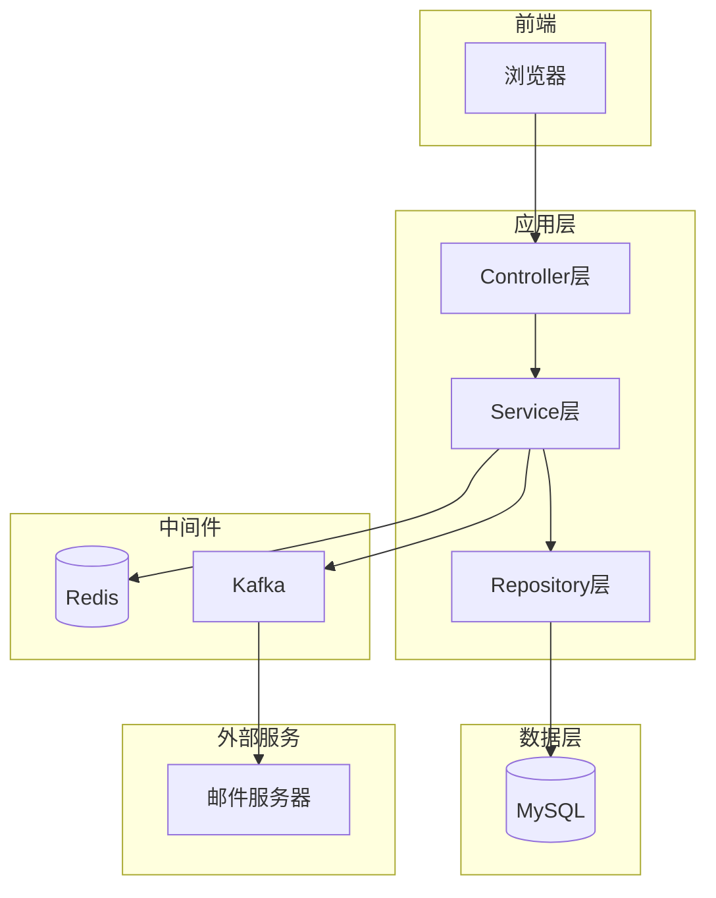
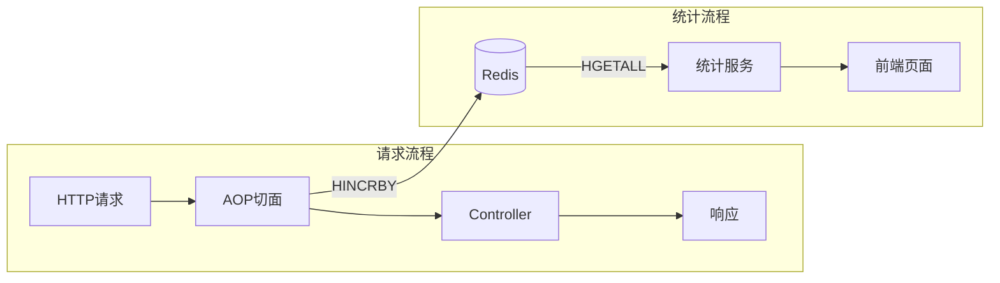
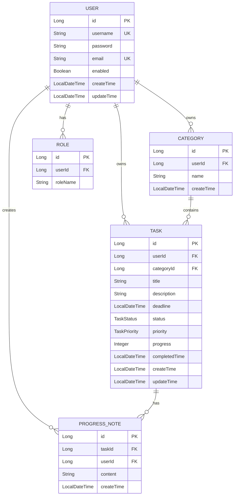

# 设计文档

## 概述

DDL管理系统采用Spring Boot单体架构，基于MVC分层模式开发。系统使用MySQL作为主数据库，Redis作为缓存和会话存储，Kafka处理异步消息（DDL提醒），Thymeleaf渲染前端页面。

### 技术栈

| 层次 | 技术选型 |
|------|----------|
| 后端框架 | Spring Boot 2.5.x |
| 安全框架 | Spring Security |
| 数据持久化 | Spring Data JPA + MySQL |
| 缓存 | Redis (Spring Data Redis) |
| 消息队列 | Apache Kafka |
| 前端模板 | Thymeleaf |
| 容器化 | Docker + docker-compose |

## 架构

### 系统架构图



### 分层职责

- **Controller层**: 接收HTTP请求，参数校验，调用Service，返回视图或JSON
- **Service层**: 业务逻辑处理，事务管理，缓存操作，消息发送
- **Repository层**: 数据访问，JPA接口定义
- **Entity层**: 数据库实体映射
- **Config层**: 配置类（Security、Redis、Kafka等）

## 组件与接口

com.ddl.manager
├── DdlApplication.java             # 启动类
│
├── infrastructure/                 # 【基础设施层】：与业务无关的技术实现
│   ├── config/                     # 全局配置 (Security, Redis, Swagger)
│   ├── exception/                  # 全局异常处理
│   └── util/                       # 通用工具 (DateUtil, JwtUtil)
│
├── shared/                         # 【共享内核】：各模块公用的对象
│   ├── dto/                        # 通用 API 响应结构 (Result, PageResult)
│   └── event/                      # 领域事件定义 (如 TaskCreatedEvent)
│
└── domain/                         # 【领域层】：核心业务，按业务模块划分
    │
    ├── auth/                       # 1. 认证与用户上下文
    │   ├── controller/             # AuthController, AdminController
    │   ├── service/                # UserService, CustomUserDetailsService
    │   ├── repository/             # UserRepository
    │   └── model/                  # User (Entity), Role (Entity)
    │
    ├── task/                       # 2. 任务核心上下文 (最复杂的模块)
    │   ├── controller/             # TaskController, CategoryController
    │   ├── service/                # TaskService, CategoryService
    │   ├── repository/             # TaskRepository
    │   ├── model/                  # Aggregates (聚合根):
    │      ├── Task.java           # 任务实体
    │      ├── Category.java       # 分类实体
    │      └── ProgressLog.java    # 进度记录
    │   
    ├── notification/               # 3. 通知上下文 (Kafka 消费者)
    │   ├── listener/               # KafkaConsumer (监听 DDL 提醒消息)
    │   ├── service/                # EmailService (发送邮件逻辑)
    │   └── model/                  # NotificationLog (记录发送历史)
    │
    └── statistics/                 # 4. 统计上下文
        ├── controller/             # StatisticsController
        ├── service/                # StatisticsService
        ├── aspect/                 # ApiStatisticsAspect (AOP切面)
        └── annotation/             # @ApiStatistics (自定义注解)

### 关键接口设计

#### 认证接口 (AuthController)

| 方法 | 路径 | 描述 |
|------|------|------|
| GET | /login | 登录页面 |
| POST | /login | 登录处理（Spring Security） |
| GET | /register | 注册页面 |
| POST | /register | 注册处理 |
| POST | /logout | 登出处理 |

#### 任务接口 (TaskController)

| 方法 | 路径 | 描述 |
|------|------|------|
| GET | /tasks | 任务列表页 |
| GET | /tasks/{id} | 任务详情页 |
| GET | /tasks/new | 新建任务页 |
| POST | /tasks | 创建任务 |
| GET | /tasks/{id}/edit | 编辑任务页 |
| PUT | /tasks/{id} | 更新任务 |
| DELETE | /tasks/{id} | 删除任务 |
| POST | /tasks/{id}/progress | 添加进度备注 |

#### 分类接口 (CategoryController)

| 方法 | 路径 | 描述 |
|------|------|------|
| GET | /categories | 分类列表 |
| POST | /categories | 创建分类 |
| DELETE | /categories/{id} | 删除分类 |

#### 管理员接口 (AdminController)

| 方法 | 路径 | 描述 |
|------|------|------|
| GET | /admin/users | 用户列表 |
| POST | /admin/users | 创建用户 |
| PUT | /admin/users/{id} | 修改用户 |
| DELETE | /admin/users/{id} | 删除/禁用用户 |
| GET | /admin/statistics | 接口统计页 |

#### 统计接口 (StatisticsController)

| 方法 | 路径 | 描述 |
|------|------|------|
| GET | /admin/statistics | 统计页面 |
| GET | /api/statistics/all | 获取所有接口统计数据 |
| GET | /api/statistics/top | 获取Top N热门接口 |
| DELETE | /api/statistics/clear | 清空统计数据（管理员） |

## 接口统计模块设计（AOP + Redis）

### 架构设计



### 核心组件

#### 1. @ApiStatistics 自定义注解

```java
/**
 * 接口统计注解
 * 标记需要统计调用次数的接口
 * @author developer
 * @since 2025-12-13
 */
@Target(ElementType.METHOD)
@Retention(RetentionPolicy.RUNTIME)
@Documented
public @interface ApiStatistics {
    
    /** 接口名称（用于展示） */
    String value() default "";
    
    /** 接口分组（如：任务管理、用户管理） */
    String group() default "default";
}
```

#### 2. ApiStatisticsAspect AOP切面

```java
/**
 * 接口统计AOP切面
 * 使用@Around环绕通知拦截标记的接口
 * @author developer
 * @since 2025-12-13
 */
@Aspect
@Component
@Slf4j
public class ApiStatisticsAspect {
    
    /** Redis统计Key */
    private static final String STATISTICS_KEY = "api:statistics";
    
    @Autowired
    private RedisTemplate<String, Object> redisTemplate;
    
    /**
     * 环绕通知：拦截所有标记@ApiStatistics的方法
     */
    @Around("@annotation(apiStatistics)")
    public Object around(ProceedingJoinPoint joinPoint, ApiStatistics apiStatistics) throws Throwable {
        // 1. 获取接口路径
        String apiPath = getApiPath(joinPoint);
        
        // 2. 使用Redis原子操作递增计数
        redisTemplate.opsForHash().increment(STATISTICS_KEY, apiPath, 1);
        
        // 3. 记录日志
        log.debug("API调用统计: {}", apiPath);
        
        // 4. 执行原方法
        return joinPoint.proceed();
    }
    
    /**
     * 获取接口路径
     */
    private String getApiPath(ProceedingJoinPoint joinPoint) {
        MethodSignature signature = (MethodSignature) joinPoint.getSignature();
        Method method = signature.getMethod();
        
        // 获取类上的@RequestMapping
        RequestMapping classMapping = method.getDeclaringClass().getAnnotation(RequestMapping.class);
        String classPath = classMapping != null ? classMapping.value()[0] : "";
        
        // 获取方法上的@GetMapping/@PostMapping等
        String methodPath = "";
        if (method.isAnnotationPresent(GetMapping.class)) {
            methodPath = method.getAnnotation(GetMapping.class).value()[0];
        } else if (method.isAnnotationPresent(PostMapping.class)) {
            methodPath = method.getAnnotation(PostMapping.class).value()[0];
        }
        // ... 其他映射注解
        
        return classPath + methodPath;
    }
}
```

#### 3. StatisticsService 统计服务

```java
/**
 * 统计服务接口
 * @author developer
 * @since 2025-12-13
 */
public interface StatisticsService {
    
    /** 获取所有接口统计数据 */
    Map<String, Long> getAllStatistics();
    
    /** 获取Top N热门接口 */
    List<ApiStatisticsVO> getTopStatistics(int topN);
    
    /** 清空统计数据 */
    void clearStatistics();
    
    /** 获取单个接口调用次数 */
    Long getApiCount(String apiPath);
}

/**
 * 统计服务实现
 */
@Service
public class StatisticsServiceImpl implements StatisticsService {
    
    private static final String STATISTICS_KEY = "api:statistics";
    
    @Autowired
    private RedisTemplate<String, Object> redisTemplate;
    
    @Override
    public Map<String, Long> getAllStatistics() {
        Map<Object, Object> entries = redisTemplate.opsForHash().entries(STATISTICS_KEY);
        Map<String, Long> result = new HashMap<>();
        entries.forEach((k, v) -> result.put(k.toString(), Long.parseLong(v.toString())));
        return result;
    }
    
    @Override
    public List<ApiStatisticsVO> getTopStatistics(int topN) {
        Map<String, Long> all = getAllStatistics();
        return all.entrySet().stream()
                .sorted(Map.Entry.<String, Long>comparingByValue().reversed())
                .limit(topN)
                .map(e -> new ApiStatisticsVO(e.getKey(), e.getValue()))
                .collect(Collectors.toList());
    }
    
    @Override
    public void clearStatistics() {
        redisTemplate.delete(STATISTICS_KEY);
    }
    
    @Override
    public Long getApiCount(String apiPath) {
        Object count = redisTemplate.opsForHash().get(STATISTICS_KEY, apiPath);
        return count != null ? Long.parseLong(count.toString()) : 0L;
    }
}
```

#### 4. ApiStatisticsVO 统计数据VO

```java
/**
 * 接口统计数据VO
 * @author developer
 * @since 2025-12-13
 */
@Getter
@Setter
@AllArgsConstructor
@NoArgsConstructor
public class ApiStatisticsVO {
    
    /** 接口路径 */
    private String apiPath;
    
    /** 调用次数 */
    private Long count;
    
    /** 接口名称（可选） */
    private String apiName;
    
    public ApiStatisticsVO(String apiPath, Long count) {
        this.apiPath = apiPath;
        this.count = count;
    }
}
```

### Redis存储结构

```
Key: api:statistics
Type: Hash

Field                    | Value
-------------------------|-------
/tasks                   | 1523
/tasks/{id}              | 892
/tasks/new               | 456
/admin/users             | 123
/api/statistics/all      | 45
```

### 使用示例

```java
@RestController
@RequestMapping("/tasks")
public class TaskController {
    
    @ApiStatistics(value = "任务列表", group = "任务管理")
    @GetMapping
    public String listTasks() {
        // ...
    }
    
    @ApiStatistics(value = "创建任务", group = "任务管理")
    @PostMapping
    public AjaxResult createTask(@RequestBody TaskEntity task) {
        // ...
    }
    
    @ApiStatistics(value = "删除任务", group = "任务管理")
    @DeleteMapping("/{id}")
    public AjaxResult deleteTask(@PathVariable Long id) {
        // ...
    }
}
```

### 前端展示设计

统计页面（admin-statistics.html）包含：

1. **统计概览卡片**
   - 总调用次数
   - 今日调用次数
   - 接口数量

2. **接口调用排行榜**
   - 表格展示Top 10热门接口
   - 显示接口路径、调用次数、占比

3. **可视化图表**
   - 柱状图：展示各接口调用次数对比
   - 饼图：展示接口调用占比分布

```html
<!-- admin-statistics.html 示例结构 -->
<div class="statistics-container">
    <!-- 统计概览 -->
    <div class="stats-overview">
        <div class="stat-card">
            <h3>总调用次数</h3>
            <span th:text="${totalCount}">0</span>
        </div>
        <div class="stat-card">
            <h3>接口数量</h3>
            <span th:text="${apiCount}">0</span>
        </div>
    </div>
    
    <!-- 排行榜 -->
    <div class="stats-table">
        <h3>接口调用排行榜</h3>
        <table>
            <thead>
                <tr>
                    <th>排名</th>
                    <th>接口路径</th>
                    <th>调用次数</th>
                    <th>占比</th>
                </tr>
            </thead>
            <tbody>
                <tr th:each="stat, index : ${statistics}">
                    <td th:text="${index.count}">1</td>
                    <td th:text="${stat.apiPath}">/tasks</td>
                    <td th:text="${stat.count}">0</td>
                    <td th:text="${stat.percentage}">0%</td>
                </tr>
            </tbody>
        </table>
    </div>
    
    <!-- 图表 -->
    <div class="stats-chart">
        <canvas id="apiChart"></canvas>
    </div>
</div>

<script>
// 使用Chart.js绘制图表
const ctx = document.getElementById('apiChart').getContext('2d');
new Chart(ctx, {
    type: 'bar',
    data: {
        labels: /*[[${apiPaths}]]*/ [],
        datasets: [{
            label: '调用次数',
            data: /*[[${apiCounts}]]*/ [],
            backgroundColor: 'rgba(54, 162, 235, 0.5)'
        }]
    }
});
</script>
```

## 数据模型

### ER图



### 实体类设计

#### 安全设计：双ID策略

所有实体采用双ID设计：
- **id (Long)**: 内部自增主键，用于数据库关联和内部查询
- **uuid (String)**: 对外暴露的唯一标识，用于API和前端交互

这样可以防止：
- ID遍历攻击（无法通过递增ID猜测其他资源）
- 信息泄露（不暴露数据量和创建顺序）

#### 基础实体类（抽取公共字段）

```java
@MappedSuperclass
@Getter
@Setter
public abstract class BaseEntity {
    @Id
    @GeneratedValue(strategy = GenerationType.IDENTITY)
    private Long id;
    
    /** 对外暴露的唯一标识 */
    @Column(unique = true, nullable = false, length = 36, updatable = false)
    private String uuid;
    
    @Column(updatable = false)
    private LocalDateTime createTime;
    
    private LocalDateTime updateTime;
    
    @PrePersist
    public void prePersist() {
        LocalDateTime now = LocalDateTime.now();
        if (this.uuid == null) {
            this.uuid = UUID.randomUUID().toString();
        }
        if (this.createTime == null) {
            this.createTime = now;
        }
        this.updateTime = now;
    }
    
    @PreUpdate
    public void preUpdate() {
        this.updateTime = LocalDateTime.now();
    }
}
```

#### UserEntity

```java
@Entity
@Table(name = "sys_user", indexes = {
    @Index(name = "idx_user_uuid", columnList = "uuid"),
    @Index(name = "idx_user_username", columnList = "username"),
    @Index(name = "idx_user_email", columnList = "email")
})
@Getter
@Setter
@NoArgsConstructor
@AllArgsConstructor
@Builder
public class UserEntity extends BaseEntity {
    
    @Column(unique = true, nullable = false, length = 50)
    private String username;
    
    @Column(nullable = false)
    private String password;
    
    @Column(unique = true, nullable = false, length = 100)
    private String email;
    
    /** 账户状态：true-启用，false-禁用 */
    @Column(nullable = false)
    @Builder.Default
    private Boolean enabled = true;
    
    /** 提醒阈值（小时），默认24小时前提醒 */
    @Column(nullable = false)
    @Builder.Default
    private Integer reminderHours = 24;
    
    /** 是否开启邮件提醒 */
    @Column(nullable = false)
    @Builder.Default
    private Boolean emailNotificationEnabled = true;
    
    @ManyToMany(fetch = FetchType.EAGER)
    @JoinTable(
        name = "sys_user_role",
        joinColumns = @JoinColumn(name = "user_id"),
        inverseJoinColumns = @JoinColumn(name = "role_id")
    )
    @Builder.Default
    private Set<RoleEntity> roles = new HashSet<>();
}
```

#### RoleEntity

```java
@Entity
@Table(name = "sys_role")
@Getter
@Setter
@NoArgsConstructor
@AllArgsConstructor
@Builder
public class RoleEntity {
    @Id
    @GeneratedValue(strategy = GenerationType.IDENTITY)
    private Long id;
    
    /** 角色标识，如 ROLE_USER, ROLE_ADMIN */
    @Column(unique = true, nullable = false, length = 50)
    private String code;
    
    /** 角色名称，如 普通用户, 管理员 */
    @Column(nullable = false, length = 50)
    private String name;
    
    @ManyToMany(mappedBy = "roles")
    private Set<UserEntity> users = new HashSet<>();
}
```

#### TaskEntity

```java
@Entity
@Table(name = "ddl_task", indexes = {
    @Index(name = "idx_task_uuid", columnList = "uuid"),
    @Index(name = "idx_task_user_id", columnList = "userId"),
    @Index(name = "idx_task_deadline", columnList = "deadline"),
    @Index(name = "idx_task_status", columnList = "status")
})
@Getter
@Setter
@NoArgsConstructor
@AllArgsConstructor
@Builder
public class TaskEntity extends BaseEntity {
    
    @Column(nullable = false)
    private Long userId;
    
    private Long categoryId;
    
    @Column(nullable = false, length = 200)
    private String title;
    
    @Column(length = 2000)
    private String description;
    
    @Column(nullable = false)
    private LocalDateTime deadline;
    
    @Enumerated(EnumType.STRING)
    @Column(nullable = false, length = 20)
    @Builder.Default
    private TaskStatus status = TaskStatus.TODO;
    
    @Enumerated(EnumType.STRING)
    @Column(length = 20)
    @Builder.Default
    private TaskPriority priority = TaskPriority.MEDIUM;
    
    /** 进度百分比 0-100 */
    @Column(nullable = false)
    @Min(0)
    @Max(100)
    @Builder.Default
    private Integer progress = 0;
    
    /** 完成时间，状态变为COMPLETED时自动设置 */
    private LocalDateTime completedTime;
    
    /** 是否已发送提醒 */
    @Column(nullable = false)
    @Builder.Default
    private Boolean reminderSent = false;
    
    /** 关联的进度记录 */
    @OneToMany(mappedBy = "task", cascade = CascadeType.ALL, orphanRemoval = true)
    @OrderBy("createTime DESC")
    @Builder.Default
    private List<ProgressLogEntity> progressLogs = new ArrayList<>();
    
    /** 标记任务完成 */
    public void markCompleted() {
        this.status = TaskStatus.COMPLETED;
        this.completedTime = LocalDateTime.now();
        this.progress = 100;
    }
    
    /** 判断是否需要发送提醒 */
    public boolean needsReminder(int reminderHours) {
        if (this.status == TaskStatus.COMPLETED || this.status == TaskStatus.CANCELED) {
            return false;
        }
        if (this.reminderSent) {
            return false;
        }
        LocalDateTime reminderTime = this.deadline.minusHours(reminderHours);
        return LocalDateTime.now().isAfter(reminderTime);
    }
}
```

#### CategoryEntity

```java
@Entity
@Table(name = "ddl_category", indexes = {
    @Index(name = "idx_category_uuid", columnList = "uuid"),
    @Index(name = "idx_category_user_id", columnList = "userId")
})
@Getter
@Setter
@NoArgsConstructor
@AllArgsConstructor
@Builder
public class CategoryEntity extends BaseEntity {
    
    @Column(nullable = false)
    private Long userId;
    
    @Column(nullable = false, length = 50)
    private String name;
    
    /** 分类颜色（用于前端展示） */
    @Column(length = 20)
    private String color;
    
    /** 排序权重 */
    @Column(nullable = false)
    @Builder.Default
    private Integer sortOrder = 0;
}
```

#### ProgressLogEntity（进度记录）

```java
@Entity
@Table(name = "ddl_progress_log", indexes = {
    @Index(name = "idx_progress_task_id", columnList = "taskId")
})
@Getter
@Setter
@NoArgsConstructor
@AllArgsConstructor
@Builder
public class ProgressLogEntity extends BaseEntity {
    
    @Column(nullable = false)
    private Long taskId;
    
    @Column(nullable = false)
    private Long userId;
    
    /** 进度备注内容 */
    @Column(nullable = false, length = 1000)
    private String content;
    
    /** 记录时的进度百分比 */
    private Integer progressSnapshot;
    
    /** 记录时的状态 */
    @Enumerated(EnumType.STRING)
    @Column(length = 20)
    private TaskStatus statusSnapshot;
    
    @ManyToOne(fetch = FetchType.LAZY)
    @JoinColumn(name = "taskId", insertable = false, updatable = false)
    private TaskEntity task;
}
```

#### NotificationLogEntity（通知记录）

```java
@Entity
@Table(name = "sys_notification_log", indexes = {
    @Index(name = "idx_notification_user_id", columnList = "userId"),
    @Index(name = "idx_notification_task_id", columnList = "taskId")
})
@Getter
@Setter
@NoArgsConstructor
@AllArgsConstructor
@Builder
public class NotificationLogEntity extends BaseEntity {
    
    @Column(nullable = false)
    private Long userId;
    
    @Column(nullable = false)
    private Long taskId;
    
    @Enumerated(EnumType.STRING)
    @Column(nullable = false, length = 20)
    private NotificationType type;
    
    @Enumerated(EnumType.STRING)
    @Column(nullable = false, length = 20)
    @Builder.Default
    private NotificationStatus status = NotificationStatus.PENDING;
    
    /** 发送目标（邮箱地址等） */
    @Column(length = 200)
    private String target;
    
    /** 通知内容 */
    @Column(length = 2000)
    private String content;
    
    /** 发送时间 */
    private LocalDateTime sentTime;
    
    /** 失败原因 */
    @Column(length = 500)
    private String errorMessage;
    
    /** 重试次数 */
    @Column(nullable = false)
    @Builder.Default
    private Integer retryCount = 0;
}
```

#### API路径设计

前端交互使用UUID：
```
GET  /tasks/{uuid}        # 获取任务详情
PUT  /tasks/{uuid}        # 更新任务
DELETE /tasks/{uuid}      # 删除任务
```

### 枚举定义

```java
/**
 * 任务状态枚举
 */
@Getter
@AllArgsConstructor
public enum TaskStatus {
    TODO("待办", 1),
    IN_PROGRESS("进行中", 2),
    COMPLETED("已完成", 3),
    CANCELED("已取消", 4);
    
    private final String label;
    private final int order;  // 用于排序
    
    /** 是否为终态（不可再变更） */
    public boolean isTerminal() {
        return this == COMPLETED || this == CANCELED;
    }
    
    /** 是否需要发送提醒 */
    public boolean needsReminder() {
        return this == TODO || this == IN_PROGRESS;
    }
}

/**
 * 任务优先级枚举
 */
@Getter
@AllArgsConstructor
public enum TaskPriority {
    LOW("低", 1, "#52c41a"),      // 绿色
    MEDIUM("中", 2, "#1890ff"),   // 蓝色
    HIGH("高", 3, "#faad14"),     // 橙色
    URGENT("紧急", 4, "#f5222d"); // 红色
    
    private final String label;
    private final int weight;  // 权重，用于排序
    private final String color; // 前端展示颜色
}

/**
 * 通知类型枚举
 */
@Getter
@AllArgsConstructor
public enum NotificationType {
    EMAIL("邮件"),
    SYSTEM("站内信");
    
    private final String label;
}

/**
 * 通知状态枚举
 */
@Getter
@AllArgsConstructor
public enum NotificationStatus {
    PENDING("待发送"),
    SENT("已发送"),
    FAILED("发送失败");
    
    private final String label;
}
```

## 错误处理

### 异常类型设计

系统定义两种自定义异常，分别处理业务逻辑错误和系统级错误：

#### BusinessException（业务异常）

用于处理可预期的业务逻辑错误，如参数校验失败、资源不存在、权限不足等。

```java
/**
 * 业务异常
 * 用于处理可预期的业务逻辑错误
 * @author developer
 * @since 2025-12-13
 */
@Getter
public class BusinessException extends RuntimeException {
    
    /** 错误码 */
    private final String code;
    
    public BusinessException(String message) {
        super(message);
        this.code = "BUSINESS_ERROR";
    }
    
    public BusinessException(String code, String message) {
        super(message);
        this.code = code;
    }
}
```

#### SystemErrorException（系统异常）

用于处理不可预期的系统级错误，如数据库连接失败、外部服务调用失败、文件IO异常等。

```java
/**
 * 系统异常
 * 用于处理不可预期的系统级错误
 * @author developer
 * @since 2025-12-13
 */
@Getter
public class SystemErrorException extends RuntimeException {
    
    /** 错误码 */
    private final String code;
    
    public SystemErrorException(String message) {
        super(message);
        this.code = "SYSTEM_ERROR";
    }
    
    public SystemErrorException(String message, Throwable cause) {
        super(message, cause);
        this.code = "SYSTEM_ERROR";
    }
    
    public SystemErrorException(String code, String message, Throwable cause) {
        super(message, cause);
        this.code = code;
    }
}
```

### 全局异常处理

使用`@ControllerAdvice`统一处理异常，支持API请求（JSON响应）和浏览器请求（页面跳转）两种模式：

```java
/**
 * 全局异常处理器
 * @author developer
 * @since 2025-12-13
 */
@Slf4j
@ControllerAdvice
public class GlobalExceptionHandler {

    /**
     * 处理业务异常
     * @param e 业务异常
     * @param request HTTP请求
     * @param redirectAttributes 重定向属性
     * @return 响应结果
     */
    @ExceptionHandler(BusinessException.class)
    public Object handleBusinessException(BusinessException e, 
                                          HttpServletRequest request, 
                                          RedirectAttributes redirectAttributes) {
        log.warn("业务异常: code={}, message={}", e.getCode(), e.getMessage());
        
        if (isApiRequest(request)) {
            return ResponseEntity.ok(AjaxResult.error(e.getCode(), e.getMessage()));
        } else {
            redirectAttributes.addFlashAttribute("errorMessage", e.getMessage());
            return redirectToReferer(request);
        }
    }
    
    /**
     * 处理系统异常
     * @param e 系统异常
     * @param request HTTP请求
     * @param redirectAttributes 重定向属性
     * @return 响应结果
     */
    @ExceptionHandler(SystemErrorException.class)
    public Object handleSystemErrorException(SystemErrorException e, 
                                             HttpServletRequest request, 
                                             RedirectAttributes redirectAttributes) {
        log.error("系统异常: code={}, message={}", e.getCode(), e.getMessage(), e);
        
        if (isApiRequest(request)) {
            return ResponseEntity
                    .status(HttpStatus.INTERNAL_SERVER_ERROR)
                    .body(AjaxResult.error(e.getCode(), "系统繁忙，请稍后重试"));
        } else {
            redirectAttributes.addFlashAttribute("errorMessage", "系统繁忙，请稍后重试");
            return "error/500";
        }
    }
    
    /**
     * 处理未知异常
     * @param e 异常
     * @param request HTTP请求
     * @return 响应结果
     */
    @ExceptionHandler(Exception.class)
    public Object handleException(Exception e, HttpServletRequest request) {
        log.error("未知异常: ", e);
        
        if (isApiRequest(request)) {
            return ResponseEntity
                    .status(HttpStatus.INTERNAL_SERVER_ERROR)
                    .body(AjaxResult.error("UNKNOWN_ERROR", "系统繁忙，请稍后重试"));
        } else {
            return "error/500";
        }
    }
    
    /**
     * 处理权限拒绝异常
     * @return 403页面
     */
    @ExceptionHandler(AccessDeniedException.class)
    public String handleAccessDenied() {
        return "error/403";
    }
    
    /**
     * 判断是否为API请求
     */
    private boolean isApiRequest(HttpServletRequest request) {
        return "XMLHttpRequest".equals(request.getHeader("X-Requested-With")) 
               || request.getRequestURI().startsWith("/api/");
    }
    
    /**
     * 重定向到来源页
     */
    private String redirectToReferer(HttpServletRequest request) {
        String referer = request.getHeader("Referer");
        if (referer != null && !referer.isEmpty()) {
            return "redirect:" + referer;
        }
        return "redirect:/";
    }
}
```

### 统一响应类（API用）

```java
/**
 * Ajax响应结果
 * @author developer
 * @since 2025-12-13
 */
@Getter
@Setter
@NoArgsConstructor
@AllArgsConstructor
public class AjaxResult {
    
    /** 是否成功 */
    private boolean success;
    
    /** 错误码 */
    private String code;
    
    /** 消息 */
    private String message;
    
    /** 数据 */
    private Object data;
    
    public static AjaxResult ok() {
        return new AjaxResult(true, "SUCCESS", "操作成功", null);
    }
    
    public static AjaxResult ok(Object data) {
        return new AjaxResult(true, "SUCCESS", "操作成功", data);
    }
    
    public static AjaxResult error(String message) {
        return new AjaxResult(false, "ERROR", message, null);
    }
    
    public static AjaxResult error(String code, String message) {
        return new AjaxResult(false, code, message, null);
    }
}
```

### 异常使用场景

| 异常类型 | 使用场景 | HTTP状态码 |
|---------|---------|-----------|
| BusinessException | 参数校验失败、资源不存在、权限不足、业务规则违反 | 200 |
| SystemErrorException | 数据库异常、Redis连接失败、Kafka发送失败、邮件发送失败 | 500 |
| AccessDeniedException | Spring Security权限拒绝 | 403 |

### 使用示例

```java
// 业务异常示例
public TaskEntity getTask(String uuid) {
    return taskRepository.findByUuid(uuid)
            .orElseThrow(() -> new BusinessException("TASK_NOT_FOUND", "任务不存在"));
}

// 系统异常示例
public void sendEmail(String to, String subject, String content) {
    try {
        mailSender.send(message);
    } catch (MailException e) {
        throw new SystemErrorException("EMAIL_SEND_FAILED", "邮件发送失败", e);
    }
}
```

## 可复用模块（来自study-2025）

基于现有学习项目，以下模块可以直接复用或简单修改后使用：

### 1. Spring Security配置（高复用度）

**来源**: `study-2025/study-security/spring-security-study-04-sqlite`

可复用内容：
- `SecurityConfig.java` - Security配置类，包含BCrypt密码加密、角色权限配置
- `User.java` + `Role.java` - 用户角色实体，多对多关系映射
- `SecurityUserService.java` - UserDetailsService实现
- `AccessDeniedHandler` - 权限拒绝处理器

需要修改：
- 数据库从SQLite改为MySQL
- 添加Redis Session支持
- 调整角色名称（teacher/student → user/admin）

### 2. Thymeleaf模板（中等复用度）

**来源**: `study-2025/study-thymeleaf/springboot-thymeleaf`

可复用内容：
- `login.html` - 登录页面模板，包含基础CSS样式
- 表单处理模式（th:action, th:object, th:field）
- 错误信息展示（th:if, th:text）

需要修改：
- 调整样式以适配DDL管理系统
- 添加更多页面（任务列表、任务详情、仪表盘等）

### 3. JPA配置（高复用度）

**来源**: `study-2025/study-5/study-5-3-sd-jpa-mysql`

可复用内容：
- `application.yml` - MySQL + JPA配置模板
- `pom.xml` - 依赖配置（spring-data-jpa, mysql-connector, lombok, validation）
- 实体类注解模式（@Entity, @Table, @Id, @GeneratedValue等）

需要修改：
- 数据库连接信息
- 添加Redis、Kafka依赖

### 4. Redis配置与使用（高复用度）

**来源**: `study-2025/study-7/study-7-2`

可复用内容：
- `RedisConfig.java` - RedisTemplate配置，包含序列化器设置
- `ArticleService.java` - Redis各种数据结构使用示例（ZSet排序、Hash存储、String计数、List列表）
- `pom.xml` - spring-boot-starter-data-redis依赖

DDL系统中的应用：
- String: 接口调用计数（原子递增）
- Hash: 用户Session存储
- ZSet: 按截止时间排序的任务列表（可选优化）

### 5. Kafka配置与使用（高复用度）

**来源**: `study-2025/study-11/study-11-2`

可复用内容：
- `KafkaProducerConfig.java` - Kafka生产者配置
- `KafkaConsumerConfig.java` - Kafka消费者配置（含手动ACK模式）
- `OrderProducerService.java` - 消息发送服务模板
- `OrderConsumerService.java` - 消息消费服务模板（@KafkaListener）
- `application.properties` - Kafka配置参数

需要修改：
- Topic名称改为ddl-reminder
- 消息实体改为DDL提醒消息
- 消费者逻辑改为发送邮件

### 6. 项目结构模式

可参考的分层结构：
- controller → service → repository → entity
- config包放置配置类
- 使用Lombok简化代码

### 复用策略汇总

| 模块 | 来源 | 复用方式 | 预计节省时间 |
|------|------|----------|-------------|
| SecurityConfig | study-security-04 | 直接复制+修改 | 2-3小时 |
| User/Role实体 | study-security-04 | 直接复制+扩展 | 1小时 |
| UserDetailsService | study-security-04 | 直接复制+修改 | 0.5小时 |
| 登录页面模板 | study-thymeleaf | 复制+样式调整 | 1小时 |
| JPA配置 | study-5-3-jpa-mysql | 直接复制 | 0.5小时 |
| RedisConfig | study-7-2 | 直接复制 | 0.5小时 |
| Redis使用模式 | study-7-2 | 参考实现 | 1小时 |
| KafkaConfig | study-11-2 | 直接复制+修改 | 1小时 |
| Kafka生产者/消费者 | study-11-2 | 复制+修改业务逻辑 | 1-2小时 |
| pom.xml依赖 | 多个模块 | 合并+扩展 | 0.5小时 |

**预计总节省时间: 8-10小时**

## 测试策略

### 测试方法

系统采用单元测试验证核心功能：

- **单元测试**: 验证Service层业务逻辑的正确性
- **集成测试**: 验证Controller层接口的完整流程（可选）

### 测试框架

使用 **JUnit 5 + Mockito** 作为测试框架。

### 测试范围

| 层次 | 测试内容 | 优先级 |
|------|---------|--------|
| Service | 业务逻辑、数据校验 | 高 |
| Repository | JPA查询方法（可选） | 中 |
| Controller | 接口集成测试（可选） | 低 |

### 测试示例

```java
@ExtendWith(MockitoExtension.class)
class TaskServiceTest {
    
    @Mock
    private TaskRepository taskRepository;
    
    @InjectMocks
    private TaskServiceImpl taskService;
    
    @Test
    void shouldCreateTaskSuccessfully() {
        // given
        TaskEntity task = TaskEntity.builder()
                .title("测试任务")
                .deadline(LocalDateTime.now().plusDays(7))
                .build();
        when(taskRepository.save(any())).thenReturn(task);
        
        // when
        TaskEntity result = taskService.createTask(task, 1L);
        
        // then
        assertNotNull(result);
        assertEquals("测试任务", result.getTitle());
    }
}
```


